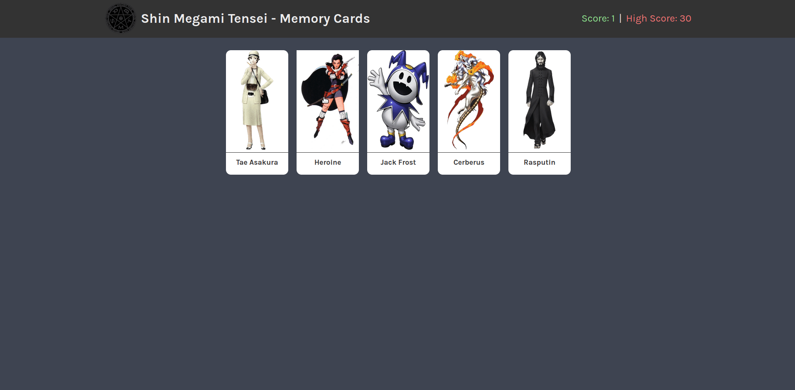

# Memory Game

A memory card game, using characters from the mainline Shin Megami Tensei series of videogames. Made with React. See it live [here](https://bofmar.github.io/memory-cards).

## How to play

At the game start, 5 cards will be displayed. You need to select each card one and only one time, in succession. After you select a card the displayed cards will be reshuffled.Selecting the same card twice will reset your score and the board. If all currently displayed cards are selected, a new one will be added to the board. Your high-score is saved to your local storage.

## Demo

